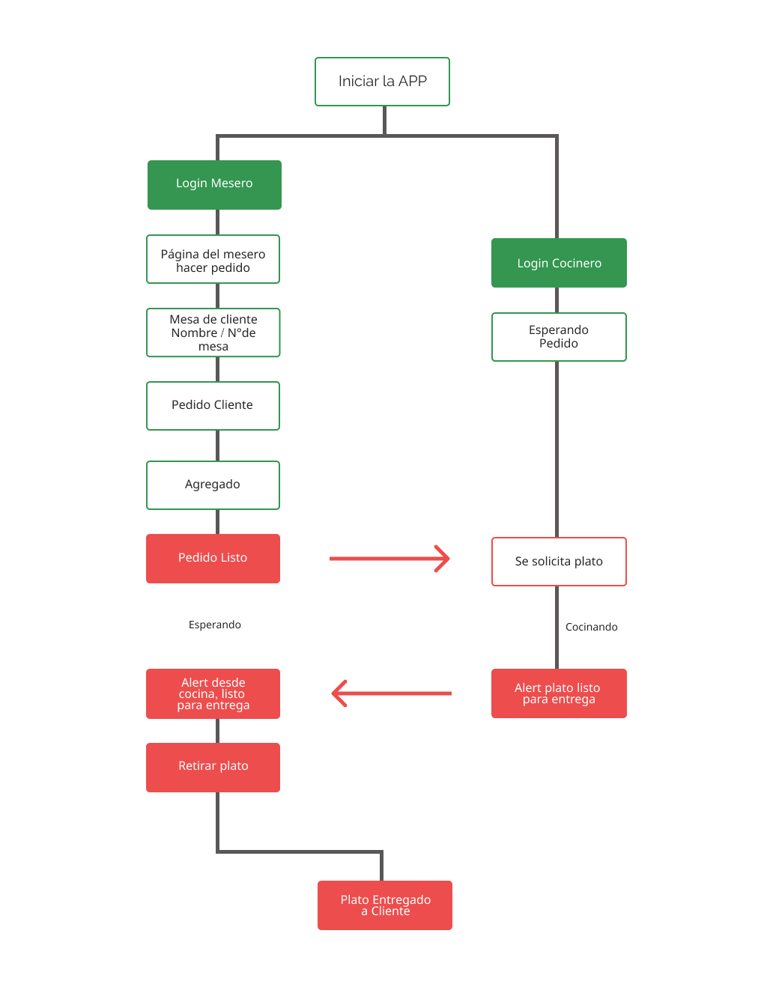
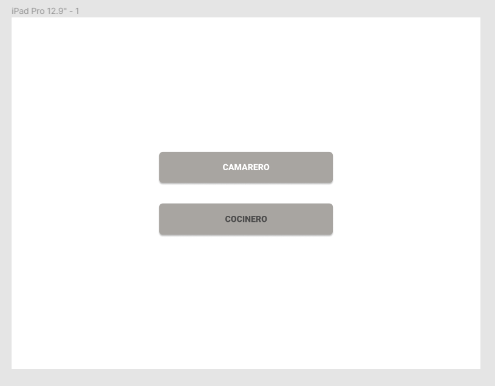
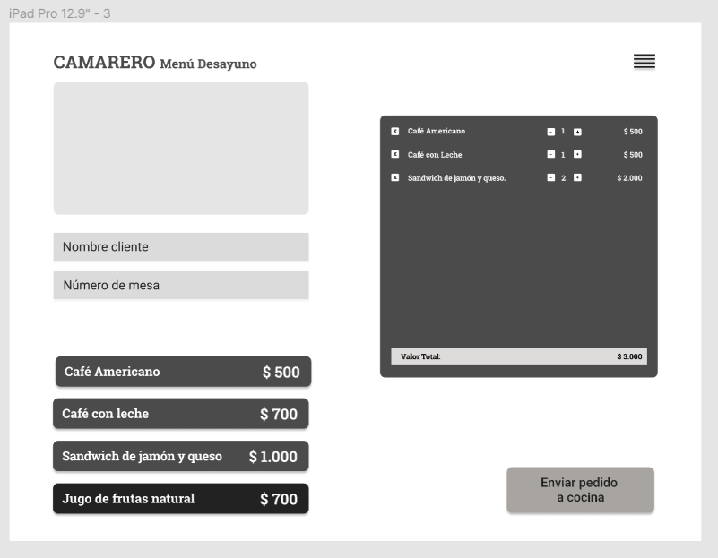
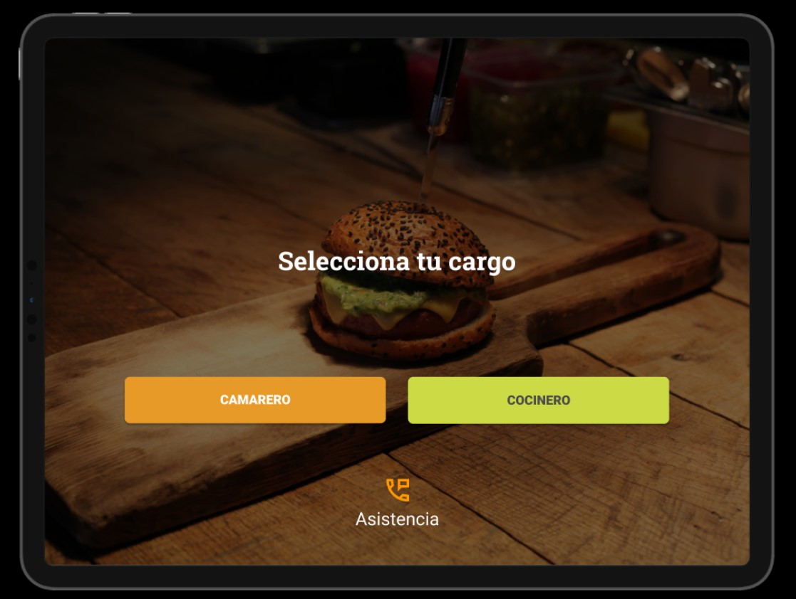
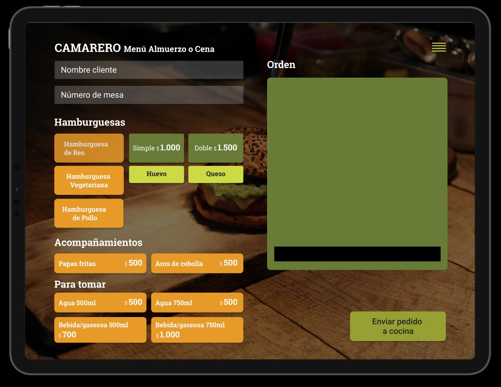
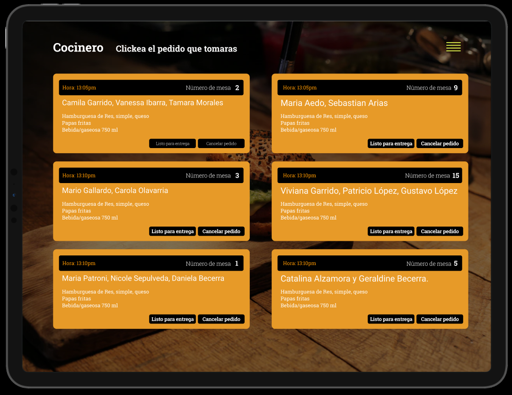
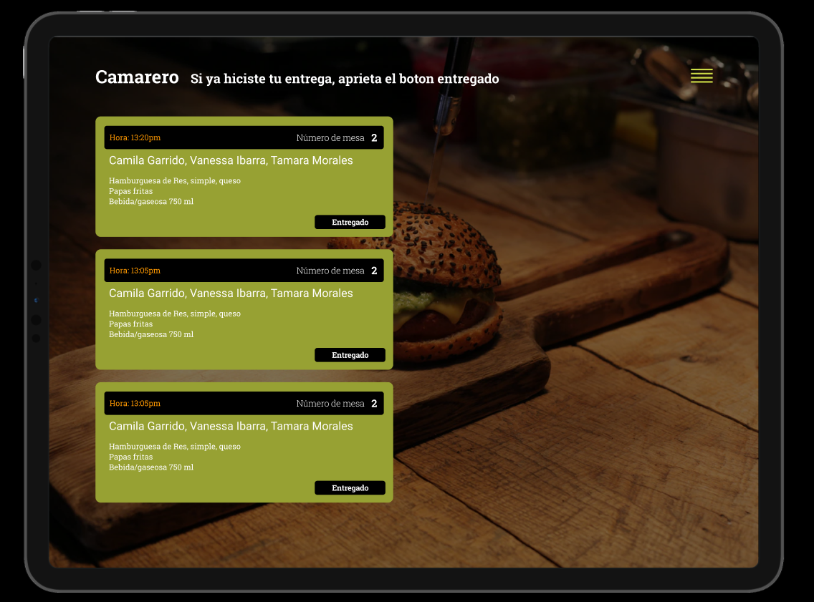
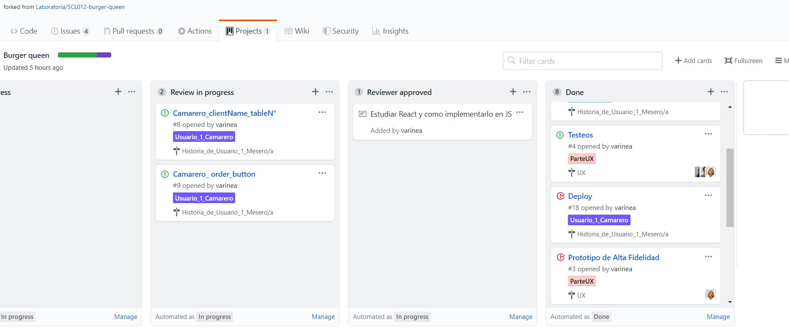

# Burguer Queen

Aplicación desarrollada para facilitar el servicio de atención en un pedido de restorant, donde el mesero podrá tomar la orden del cliente de forma facil y rapida, comunicandose con el cocinero el cual podrá tomar la orden cocinarla para luego dar aviso de la entrega, habiendo finalizado el proceso con el pedido llevado a la mesa.

## Flujo del proyecto

Flujo sobre el proceso que pensamos que deberia llevar a cabo nuestra aplicación al ser desarrollada.

## Historias de Usarios

[Historia de usuario 1] Mesero/a debe poder tomar pedido de cliente
Yo como meserx quiero tomar el pedido de un cliente para no depender de mi mala memoria, para saber cuánto cobrar, y enviarlo a la cocina para evitar errores y que se puedan ir preparando en orden.

## Proceso de diseño

### Prototipo de baja fidelidad

### Prototipo de Alta fidelidad

## Test de Usabilidad

https://www.loom.com/share/50a5526f80c245c5905ccc216ca73121

## Planificación

Toda nuestra planificación fue creada en Github, proyectos.

### Página Burger Queen

https://burger-queen-4ac86.firebaseapp.com/OrdersB

